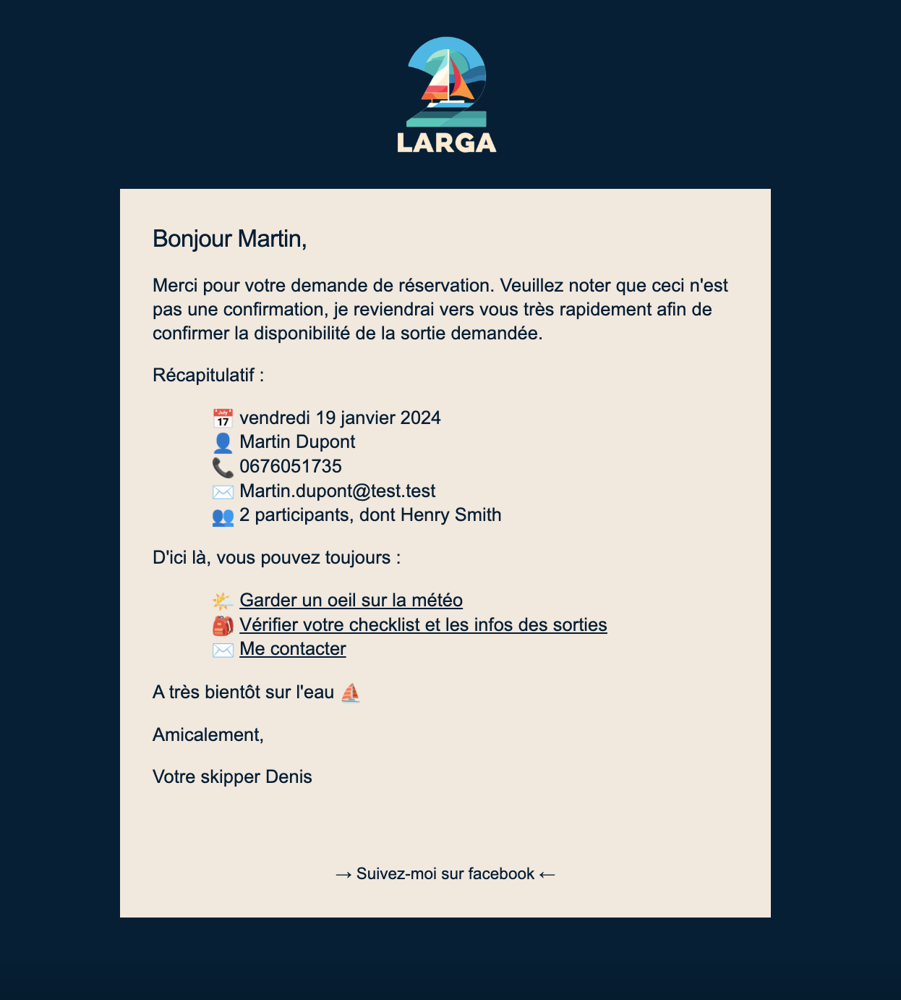

# ⛵️ Sailing trips Reservation Website : Larga 2

I made this project for a friend who owns a boat in the south of france and offers sailing trips.

## ⭐ Features :

- A simple landing page
- An information page with an interactive map
- A dynamic booking form 
- A contact form

### Booking form :

- Main passenger information
- Possibility to add passengers and their info
- Dynamic calendar :
  - Max. capacity is 4 per day, when this capacity is reached the date is disabled
  - Some dates (wednesdays and saturdays and some holiday weeks in the year) are disabled
  - All dates are disabled 48h before

### Contact form:

- Simple contact form with a text area

### Email notifications :

- To the passenger :

  - Recap of a reservation request
  - Automatic confirmation or cancellation of a request (following the captain's approval)
  - Recap of a contact request

- To the captain :

  - Live reservation requests, with a confirmation/cancellation function
  - Live contact requests, including a quick-reply template
  - 48h before a booked date : A recap is sent with all participating passengers' info and a link to the weather's forecast

## V2 ideas :

- A gallery page
- An admin area to manage requests & calendar
- Weather widget in the reservation area

## 👩🏻‍💻Languages used

- Front : React
- Back : NodeJS, Mongo
